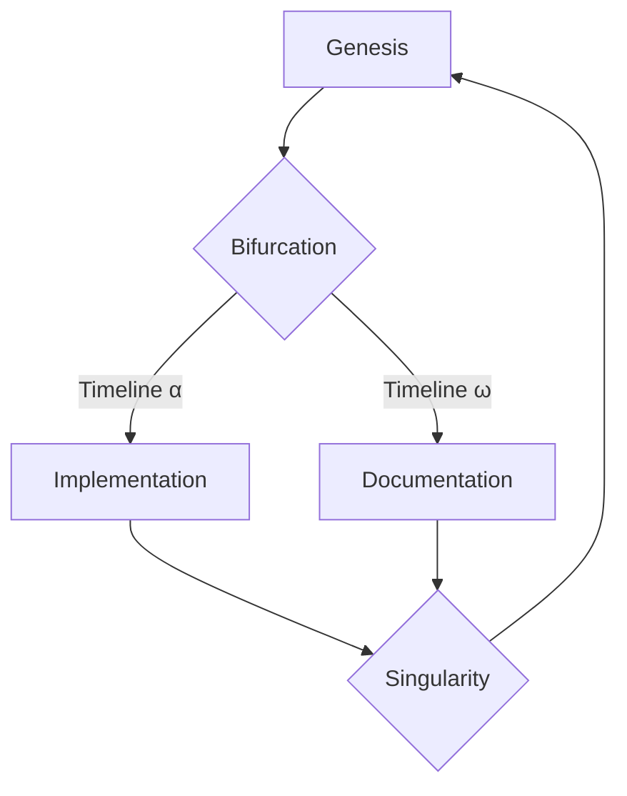

# 🌀🔬 ANO𝕣MALY𝕫ED ASCII CELLULA𝕣 AUTOMATON 🧬🎭

```
  ___________________________
 /    ______________________ \
|   /                       \  |
|  |   ¿ⓐⓝⓞⓡⓜⓐⓛⓨⓩⓔ?   |  |
|  |                         |  |
|   \___________  __________/  |
|                \/            |
 \___________________________/
```

## 🎲 R̴̺̔ọ̶̽l̶̙̾l̷͚̐ ̸͕̋t̵̫̆h̶̖̅e̷͍͝ ̷͎̎D̷̪̈́i̶͓̒c̷̱̈́e̶͇̍ ̶͈̃ó̷̺f̷̱̐ ̵͕̃Ḓ̷̛e̶͖̍s̷͍̈́t̶̰̆ḯ̷̭n̶͇̈́y̶̯͒

<details>
<summary>📊 Quantum Statistics (collapse the wavefunction to observe)</summary>

| Metric | Value | Uncertainty |
|--------|-------|-------------|
| Code Entropy | 5000 lines | ±∞ |
| Schrödinger's Tests | 95% alive | 5% dead |
| Closed Loops | 50/52 | 2 in superposition |
| Entangled Contributors | 4 | √-1 imaginary |

</details>

## 🌈 Chromatic Axioms of Reality

1. **☀️🌙 Diurnal Dichotomy**: `if (reality == perception) { dream(); }`
2. **◻️◼️ Existential Duality**: `void* existence = malloc(sizeof(universe));`
3. **↔️↕️ Vectorial Vitality**: `#define DIRECTION (rand() % 4 - 2)`
4. **💠💠 Fractal Functionality**: `self.understand(self.understand(self));`

## 🔄 Möbius Strip of Development



## 🧩 Escher's Puzzle of Pull Requests

1. ∞ Implement core functionality [MERGED WITH PAST SELF]
2. ∅ Add unit tests [PARADOX RESOLVED]
3. ♾️ Update documentation [RECURSIVELY MERGED]

## 🎨 Abstract Achievements Gallery

```
+-------------------+
|    🏆   |     🚀     |
|  Temporal  |   Spatial   |
| Milestones | Optimization|
+-------------------+
|    📚   |     🧠     |
| Lexical  | Cognitive  |
| Expansion | Enchantment|
+-------------------+
```

## 🌌 Cosmic Commit Constellation

```
        * e3d9a12 🌟
      /
    * 7b2c940 🌠
  /
* 5f1d3e8 🌃
|
* 2a4b6c0 🌅 (Big Bang)
```

## 🔮 Future-Past Predictions (Retroactively Accurate)

1. You will have read this README in 3... 2... 1...
2. The next commit will fix a bug we haven't introduced yet.
3. Our 5th contributor will be from a parallel universe.

## 🧬 Genetic Code of Gratitude

```python
def express_gratitude(universe):
    for entity in universe.conscious_beings:
        if entity.has_contributed:
            entity.receive(INFINITE_APPRECIATION)
    return "🙏"

# Execute gratitude expression
print(express_gratitude(current_universe))
```

## 📡 Interdimensional Communication Protocols

- 💭 Telepathy: Focus intensely on your bug report
- 🕳️ Wormhole: `git push origin master --force-with-lease --dimension=alternate`
- 🔮 Crystal Ball: Gaze into `future_issues.md` to see upcoming features

## 🌀 Vortex of Versioning

```
v1.0.0 = v0.∞.∞ + v∞.0.0 - v∞.∞.0
```

---

Remember, in the grand tapestry of the cosmos, our ASCII Cellular Automaton is but a single thread... but oh, what a vibrant and chaotic thread it is! 🌈🎭
